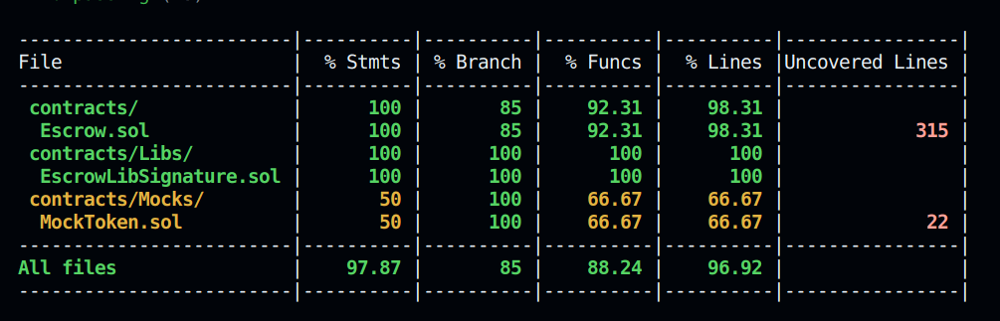

# Overview

The Escrow smart contract is designed to facilitate secure transactions between depositors and beneficiaries. The contract supports multiple depositors and beneficiaries, ensuring that each deposit has a designated beneficiary. The process involves depositors sending ERC20 tokens or ETH to the contract and specifying the beneficiary address, which remains concealed until the funds are released. The beneficiary can sign the release funds order off-chain, and anyone can submit it to the chain for execution. Upon submission, the funds are transferred to the specified beneficiary address.
Each deposit has a unique id.

This contract aims to enhance security and organization in managing deposits and releasing of funds by verification of signature using ECDSA.

This contract is deployed using a Transparent Proxy, enabling easy addition or modification of functionalities in the future.

### Additional functionality:
This smart contract contains some extra functionalities whcih are defined below: 

#### 1. releaseFunds
This function can be directly called by the beneficiary on chain to release the funds.

#### 2. sweepEth
This function can be called by the owner of the contract to sweep the ETH from the contract.

Recommendation: The owner should be the multisig or Governance address

#### 2. sweepToken
This function can be called by the owner of the contract to sweep the ERC20 tokens from the contract.

### Run project by following the steps below:

Copy the ``.env.example`` file in a new file ``.env``.

Install node:
```shell
nvm install v18.0.0
```

Then run command to use the installed node version
```shell
nvm use v18.0.0
```

First install the dependencies:
```shell
yarn install
```
To compile the smart contracts use command:
```shell
npx hardhat compile
```

To run test cases use command:
```shell
npx hardhat test
```

To deploy Escrow on hardhat local network use command:
```shell
npx hardhat run scripts/deployEscrow.ts
```

To deploy Escrow on testnet or mainnet use command:
```shell
npx hardhat run scripts/deployEscrow.ts --network <network name>
```

To deploy on network remember to save network url, api key, private key in .env file which will be exported in hardhat.config.ts file.

The Escrow contract is deployed on bsctestnet:
[`0xEf8a2FBb7EE3bE39345F07b300060fcA1Bc5A65B`](https://testnet.bscscan.com/address/0xEf8a2FBb7EE3bE39345F07b300060fcA1Bc5A65B)

# Coverage

# Conclusion

In conclusion, the escrow contract provides a robust mechanism for securely managing transactions between parties. By **leveraging** cryptographic techniques like hashing and off-chain signatures, the contract ensures the confidentiality and integrity of beneficiary addresses and release orders. With support for multiple depositors and beneficiaries, the contract offers flexibility and scalability for various use cases. Overall, the escrow contract serves as a reliable and transparent intermediary, facilitating trustful interactions in decentralized environments.